<div align="center">



<br/>

[English](../README.md) | [Русский](README.ru.md) | [Español](README.es.md) | [中文](README.zh.md) | [日本語](README.ja.md) | [Français](README.fr.md) | [Deutsch](README.de.md)

</div>

---

# MDFLAG

**Feature-Flags für KI-Agenten. Kein SaaS. Keine API-Schlüssel. Nur einfache Markdown-Dateien in Ihrem Git-Repository.**

KI-Coding-Agenten (Cursor, Claude Code, Copilot, Windsurf) generieren und fügen Code direkt in Ihr Projekt ein. Wenn der Code Fehler enthält, bricht die gesamte Anwendung zusammen. Ein Rollback ist teuer und zeitaufwendig.

Herkömmliche Feature-Flag-Tools (LaunchDarkly, Statsig, Flipt) sind für autonome Agenten unerreichbar: Sie erfordern eine Website-Registrierung, API-Schlüssel und SDK-Konfigurationen. KI-Agenten besitzen weder Browser noch E-Mail-Adressen oder Kreditkarten.

MDFLAG löst dieses Problem, indem es Feature-Flags als einfache Markdown-Dateien im Projektverzeichnis bereitstellt. Da KI-Agenten von Natur aus mit Dateien umgehen können, können sie Flags direkt und nativ nutzen.

---

## Kernidee

**KI kann Dateien in Git erstellen, sich aber nicht bei SaaS-Diensten registrieren.**

Daher gilt:
- Traditionelle Flags (LaunchDarkly) = für Agenten unzugänglich.
- Git-basierte Flags (MDFLAG) = für Agenten direkt zugänglich.

MDFLAG ist die erste Lösung, die auf den vorhandenen Fähigkeiten der KI aufbaut, anstatt zu versuchen, ihr komplexe externe Integrationen beizubringen.

---

## Funktionsweise

**Ohne Feature-Flag:**
Die KI baut einen neuen Raum, indem sie den alten abreißt. Wenn der neue Raum schief wird, stehen Sie ohne Dach da.

**Mit Feature-Flag:**
Die KI baut den neuen Raum neben dem alten. Sie entscheiden, in welchem Sie wohnen möchten. Wenn mit dem neuen Raum etwas nicht stimmt, schließen Sie einfach die Tür und bleiben im alten.

---

## Funktionen

- **Agent-native**: Funktioniert über MCP (Model Context Protocol) — keine Registrierung, keine API-Schlüssel
- **Git-basiert**: Flags sind Markdown-Dateien in Ihrem Repository und werden zusammen mit Ihrem Code versioniert
- **Integritätsschutz**: SHA-256-basierte Manipulationserkennung verhindert unbefugte Änderungen
- **Schrittweise Einführung**: Flags schrittweise für 5% → 25% → 100% der Benutzer aktivieren
- **Sofortiges Rollback**: Ändern Sie eine einzelne Zahl in einer Datei, um die Funktion sofort zu deaktivieren
- **Menschliche Kontrolle**: Agenten erstellen Flags, Menschen verwalten die Einführung

---

## Schnelleinstieg (CLI)

```bash
# Flag erstellen (0% Rollout)
mdflag create --name new-checkout --hypothesis "Konvertierung um 5% steigern"

# Rollout anpassen (25%)
mdflag rollout --name new-checkout --percentage 25

# Hash-Integrität überprüfen
mdflag verify

# Alle Flags auflisten
mdflag list
```

---

## Verwendung im Code (Go)

```go
import "github.com/legends-deadlines/mdflag/pkg/mdflag"

client, err := mdflag.New(".mdflag")
if err != nil {
    log.Fatal(err)
}

if client.Enabled("new-checkout", userID) {
    // Neuer Funktionscode
} else {
    // Bisheriger stabiler Code
}
```

---

## Lizenz

MIT-Lizenz — siehe [LICENSE](../LICENSE) für Details.

---

<div align="center">


</div>
